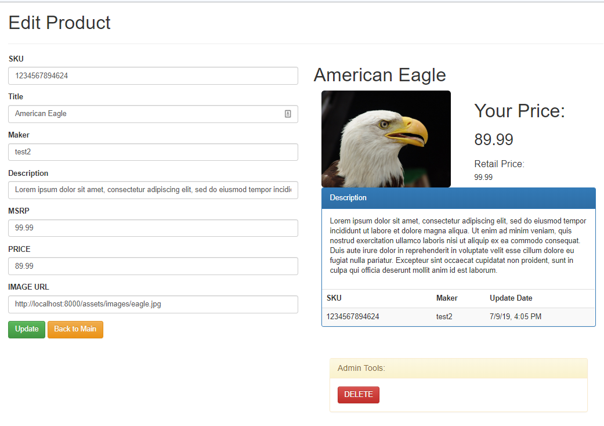

# Angular 5 + Create/Read/Undo/Delete Boiler-plate

## Getting Started

Please make sure NodeJS and NPM, it's installed on your operational system.

 1) Download `npm` dependecies by opening your terminal/bash on the directory and running:

    `npm install` or `yarn install`

## Environments

### Development server

Run `ng serve` for a dev server. Navigate to `http://localhost:4200/`. The app will automatically reload if you change any of the source files.

### Angular CLI - Code scaffolding

Run `ng generate component component-name` to generate a new component. You can also use `ng generate directive|pipe|service|class|module`.

### Angular 5 - Further help

To get more help on the Angular CLI use `ng help` or go check out the [Angular CLI README](https://github.com/angular/angular-cli/blob/master/README.md).

### Express Server & Build

Please be-aware i've attached npm start to run a build `ng build` along-side the `app.build.prod.js` which basically read's the compiled version from ng build and preview can be view from `http://localhost:8000`

### Legacy Dependencies :

1) Angular 5
2) Express (Mongoose, Bluebird)
3) MongoDB

### History Snapshot:

